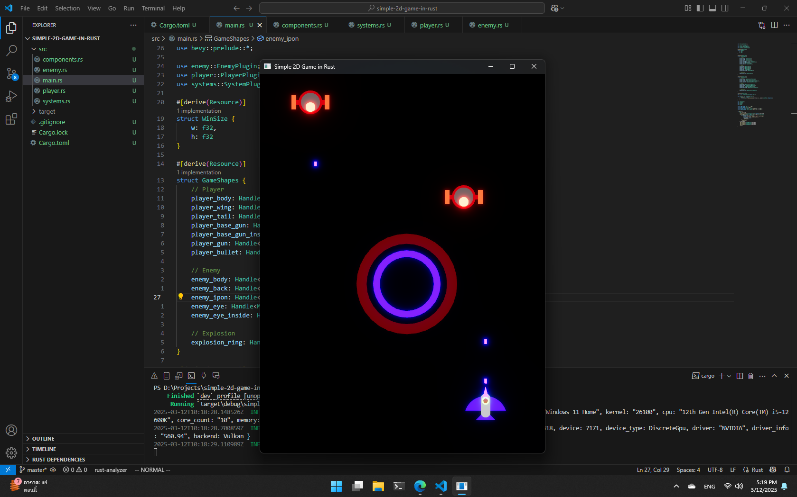

# Simple 2D Game in Rust

This is a simple 2D game built using Rust programming language. The game is designed to showcase basic 2D game development concepts using Rust and its powerful libraries.



## Requirements

Before running the game, make sure you have the following installed:

- [Rust](https://www.rust-lang.org/): Make sure Rust is installed by running `rustc --version` in the terminal.
- [Cargo](https://doc.rust-lang.org/cargo/): Cargo is the package manager and build system for Rust, and it is included when you install Rust.

## How to Run the Game

1. Clone this repository to your local machine:
   ```bash
   git clone https://github.com/yourusername/simple-2d-game-in-rust.git
   cd simple-2d-game-in-rust
   cargo run
